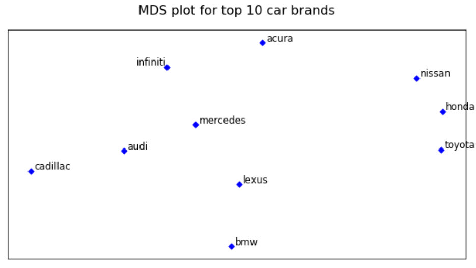

# Introduction
The aim of the project is to gather insights from social media conversations and provide actionable recommendations to the product manager and marketing team of various car brands

# Data Overview
We scraped about 7k posts about car discussions from the Edmunds.com forum

# Approach
•	Data cleaning and pre-processing using NLTK 
•	Find association between top 10 car brands through calculation of lift ratios 
•	Visualize the brands on a multi-dimensional scaling (MDS) map 
•	Understand the key attributes of top brands 
•	Find the most aspirational brands

# Results and recommendations
### Brand perception

1.	People talk about BMW and Lexus together more than the general expectation of BMW being talked along with Audi or Mercedes. This is strange given the fact that Audi, BMW and Mercedes are considered to be high-end luxury cars which would be expected to be more similar to each other while Lexus was isn’t quite at that level. A possible explanation for this could be that entry level BMW car owners considering to have more value at the same price for a fully loaded Lexus when compared to just the pricey logo of BMW 
2.	Honda, Toyota and Nissan - the asian cars are clustered together. These 3 are most talked about brands as a group. This can be attributed to the fact that these brands have similar product placements and pricing 
3.	Acura and Infinity are relatively isolated from other brands which makes it tough for them to get traction in other brand users. On a positve note, they will have less churn rate too

### Attribute association with brands

#### Insights to Product Manager
1.	BMW: Though BMW claims they are ‘The Ultimate Driving Machine’, the lift calculations between BMW and performance shows otherwise. Upon considering transmission and power, BMW does not score well either. BMW should improve the performance factor to match what their tagline says, according to general public opinion on Edmunds forum
2.	Acura: Acura passes off among the public as a forgotten luxury car, with higher quality and associated highest with reliability. However, the lift calculations show that Acura drops off at a bad rate here. The lift rate shows that Acura fails here to be qualified as a good performer. Close to the other luxury brands, that is, Mercedes and Infiniti in the MDS chart, the differentiating factor is Acura’s age-old branding as a reliable machine. If the brand captures this back and gets rid of the growing concern over Acura’s performance and reliability, the brand can reinvent itself and get back into the race
3.	Infiniti: Infiniti, another luxury brand, lies close to Acura in the MDS graph. It fails in the performance sector. While aiming for luxury, a notch better performance would help Infiniti gain a better leverage over the other above-mentioned brands. However, it has an edge over Acura in the pricing aspect.
4.	Lexus: The name Lexus itself is synonymous to luxury and dependability. In fact, Lexus has won ‘The Most Dependable Luxury brand of 2019’ - eight time in a row. This tells us that the general public do correlate Lexus not only as a luxury brand, pleasing to the eye and aesthetically rich, but also as a highly reliable car. Looking at the lift calculations show us that Lexus is less called of with price related things, which may indicate that people don't talk about Lexus's price much, a positive sign for the brand
5.	Mercedes: Mercedes, another luxury brand, fails at capturing positive ratings in the performance sector. Gaining good points in the price and transmission feature, it loses edge in the reliability feature. If Mercedes can pull up its reliability, it can race ahead in the luxury beast sector.

#### Insights to Marketing/Advertising Team
1.	BMW: Looking at the MDS graph, we can see that BMW is closer to Lexus and Mercedes. With the tagline of ‘The Ultimate Driving Machine’, if public is under the opinion that BMW’s performance is low, sales go down eventually. With the car faring well in design and price, they can used as an edge over its competitors. This can be used for marketing and advertising, increasing BMW’s hold over luxury brands.
2.	Acura: The reliability factor of Acura can be used to gain foothold in the luxury brands. Looking at the MDS chart, Acura is surrounded by luxury brands. The Lift calculations show that Acura is low in design and price, but it has a good name of a reliable car, with passable performance. These two attributes can be used to market Acura as a reliable, performing luxury car with reliability something the other luxury cars scoring much lower than Acura
3.	Infiniti: Infiniti fares high in the power part, competing well in the other sectors with its closest competitor according to MDS, Acura. Thus, using the power factor as its branding and aiming audience who wish for a powerful car, it can gain advantage over Acura
4.	Lexus: The brand itself is synonymous to luxury and reliability. No additional effort might be needed here. It does a good job in being dependable and in offering a rich experience. However, if Infiniti projects itself using aesthetics, Lexus can always use its already existing luxury tag and the dependability tag – a deadly combination
5.	Mercedes: Mercedes scores high in the price, transmission and power factor, one among highest among all the five cars discussed here. If these can be used to project Mercedes as a visual treat, with decent performance (already present), sectors that look for power and performance will be the target audience and Mercedes can compete in the luxury power beasts

### Most desirable brand
#### Toyota
Toyota is the most desired brand closely followed by Lexus and Mercedes since it has considerably high lift with aspirational words when compared to other brands. Having observed that Toyota has a high lift with reliability, imply that entry level luxury car prospected buyers are considering reliability as top attribute for their decision.
To identify this, we collated the list of aspirational words like buy, purchase, desire, want and replaced these words with the aspiration in the comment, and performed an analysis to observe lift between the brand and this aspiration word, this lift translates to the measure of people actually wanting to buy and highlighted the top brands with high lift score.
Business Implications for Toyota usually brands itself as an affordable and reliable car, so targeting this entry level luxury segment through a dedicated ad-campaign can help establishing themselves in this segment and helps them improve their market share.
